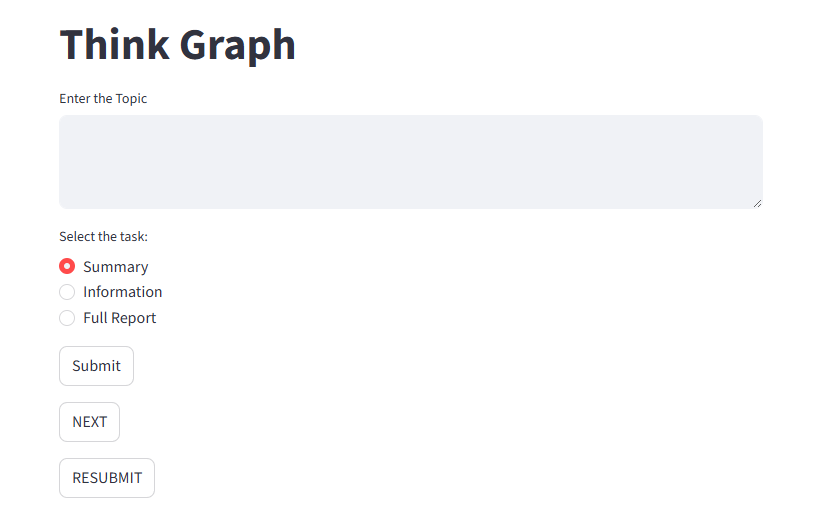
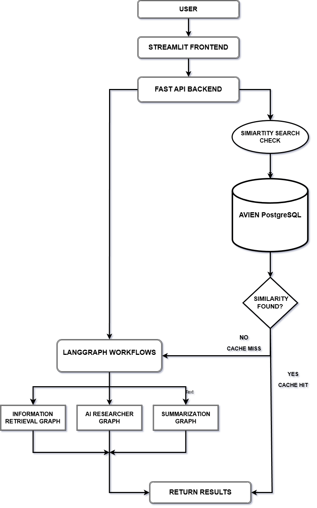
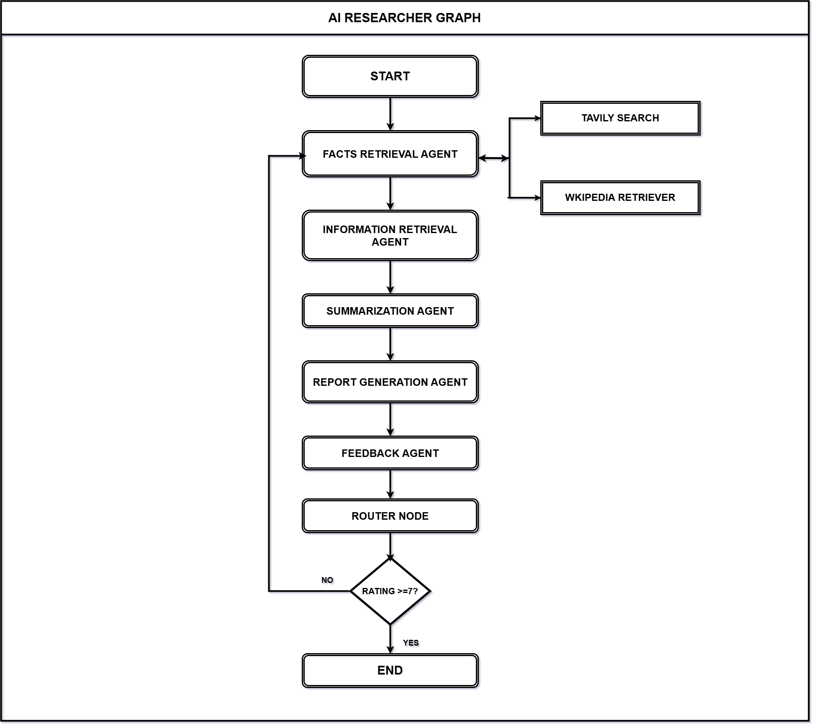

# THINK-GRAPH AI 
An AI Multi-Agent Researcher using LangGraph

An AI-powered multi-agent research assistant built with LangGraph, FastAPI, and PostgreSQL. The system orchestrates specialized AI agents to retrieve information, generate summaries, create structured reports, and evaluate report quality.

The project also implements semantic caching using PostgreSQL and pgvector to reduce redundant research requests and improve response efficiency.
## Live Deployment

- **FastAPI Swagger Docs:** [Try Now](https://think-graph-ai-orchestrator.onrender.com/docs#/)

- **Think-Graph AI UI:** [Launch App](https://think-graph-ai-orchestrator-user.onrender.com/)

## Overview
### Why this project?

Research and report generation is often a time-consuming process that involves collecting information from multiple sources, organizing findings, summarizing key insights, and maintaining report quality.

This project addresses these challenges by implementing a multi-agent AI research pipeline using LangGraph, where specialized agents collaborate to automate information retrieval, summarization, report generation, and feedback analysis.

---
## Features
- Multi-agent workflow orchestration using LangGraph
- Automated topic-based research pipeline
- Fact retrieval using Wikipedia and Tavily Search
- AI-powered information retrieval and enrichment
- Structured summarization pipeline
- Automated report generation
- Report quality evaluation and feedback scoring
- Conditional routing for report regeneration based on feedback ratings
- PostgreSQL semantic cache using pgvector
- Async execution support
- REST APIs built with FastAPI
- Streamlit-based user interface

---
## Real-World Use Case

The system can be adapted for:
- Automated research assistance
- AI-driven report generation
- Knowledge aggregation workflows
- Research summarization pipelines
- Multi-agent AI applications

---
## Example Demo 
### 1.Video Demo
[](https://youtu.be/XM-HaVSIZ_o)


### 2. Generated Report 


---
## System Architecture


## Report Generation Graph

### 1. Fact Retriever Agent
Retrieves factual information using external tools such as:
- Wikipedia Retriever
- Tavily Search

### 2. Information Retriever Agent
Enriches retrieved facts using LLM-based contextual research.

### 3. Summarizer Agent
Generates concise structured summaries.

### 4. Report Generator Agent
Produces detailed research reports.

### 5. Feedback Rating Agent
Evaluates generated reports and assigns quality ratings.

### 6. Router Conditional Node
Routes workflow execution based on feedback ratings.

---

## Subgraphs

### Summary Generation Graph

1. Fact Retriever Agent  
2. Information Retriever Agent  
3. Summarizer Agent  

This subgraph focuses on generating concise summaries from researched information.

---

### Information Retrieval Graph

1. Fact Retriever Agent  
2. Information Retriever Agent  

This subgraph focuses on collecting and enriching topic-related information.

---

## Tech Stack

### Ai / Llm 
- LangGarph
- LangChain
- Groq API
- Hugging Face Inference API

### Backend
- FastAPI
- Python

### Database
- PostgreSQL (Aiven)
- pgvector

### Deployment
- Render

## Tools & Utilities
- HTTPX
- Tavily Search
- Wikipedia Retriever
- Pydantic
- TypedDict
- Middleware

---

## Database And Caching

The project uses PostgreSQL with pgvector as a semantic caching layer to reduce redundant LLM research requests and improve response efficiency.

Before executing the multi-agent research pipeline, the system converts the user topic into vector embeddings and performs similarity search against previously stored research topics.

If a semantically similar topic is found above a similarity threshold, cached research data is reused instead of generating new research.

---

### Technologies Used

- PostgreSQL
- pgvector
- Vector embeddings
- Semantic similarity search

---

### Caching Benefits

- Reduces repeated LLM API calls
- Improves response speed
- Lowers inference cost
- Prevents redundant research generation

---

## Api Endpoints
| Method | Endpoint | Parameters | Description |
|---|---|---|---|
| GET | `/researcher/report_generator` | `topic: str`, `resubmit: bool` | Generates a structured research report for the given topic. |
| GET | `/researcher/summary_generator` | `topic: str`, `resubmit: bool` | Generates a concise summary for the given topic. |
| GET | `/researcher/information_retrieval` | `topic: str` | Retrieves structured topic-related information. |

---

## Project Structure
```
            project/
               │
               |── main/
               |    |
               |    |── api_service/
               |    |       |
               |    |       |── __init__.py
               |    |       |── api.py
               |    |       |── orchestration/
               |    |       |       |
               |    |       |       |── graph.py
               |    |       |       |── node.py
               |    |       |       └── state.py
               |    |       |
               |    |       └──requirements.txt
               |    |
               |    |── ui_service/
               |    |       |
               |    |       |── ui.py
               |    |       └── requirements.txt
               |    |
               |    |── db_conn.py
               |    └── __init__.py
               |
               |── images/
               |    |
               |    |── graphs/
               |    |
               |    └── demo/
               |    
               |── LICENSE
               |── Readme.md
               └── requirements.txt
```
## Installation & Setup

### Clone Repository

```bash
git clone https://github.com/akshatavyas01-byte/Think-Graph-Ai-Orchestrator
cd AI-Multi-Agent-Researcher
```

---

### Install Dependencies

```bash
pip install -r requirements.txt
```

---

### Environment Variables

Create a `.env` file and add:

```env
groq_api=your_api_key
hf_api=your_api_key
DB_url=your_postgresql_url
TAVILY_API_KEY=your_api_key
```

---

### Database Setup

Run `db_conn.py` once to initialize the PostgreSQL database, create table and enable the `pgvector` extension.

```bash
python db_conn.py
```
---

### Run Fastapi Server

```bash
uvicorn main.api_service.api:app --reload
```

---

### Run Streamlit UI

```bash
streamlit run main/ui_service/ui.py
```

## Challenges Faced

- Configuring cloud-hosted PostgreSQL and implementing semantic vector search using pgvector
- Tuning cosine similarity thresholds to improve semantic cache accuracy
- Managing shared graph states across multiple LangGraph agents
- Handling async result rendering in the Streamlit UI
- Implementing semantic caching to reduce redundant LLM API calls
- Structuring Python package imports and deployment configuration

## Future Improvements

- Adding RAG System to get a consice summary for a research paper
- Using different llm to imporve the output quality
- Improved UI for full software program 
- User based history database
- Implement authentication and user history
- Improve semantic cache ranking strategies
- Add support for web-based research sources
- Introduce agent memory and persistent conversations


## License
This project is licensed under the MIT License.

## Author
**Akshata Vyas**  
GitHub: [akshatavyas01-byte](https://github.com/akshatavyas01-byte)


